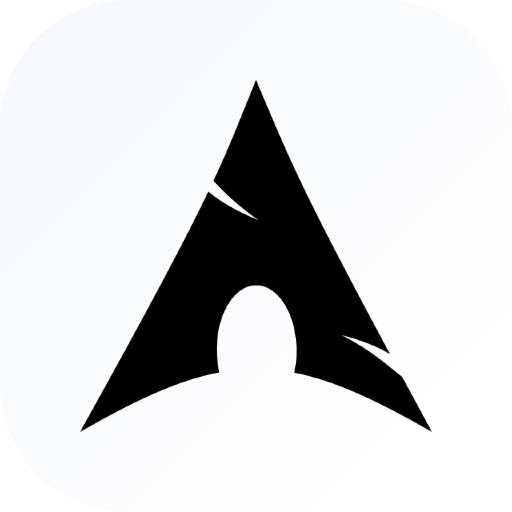
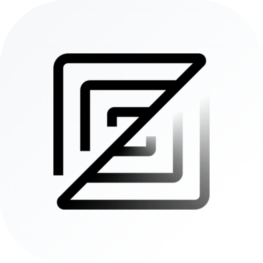
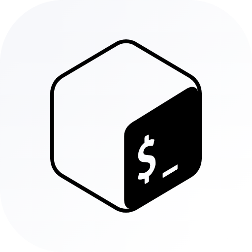
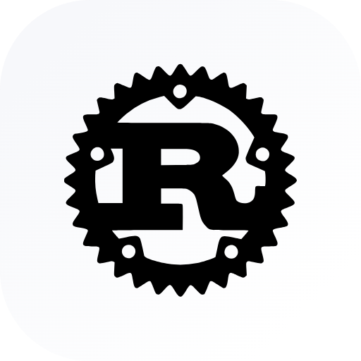
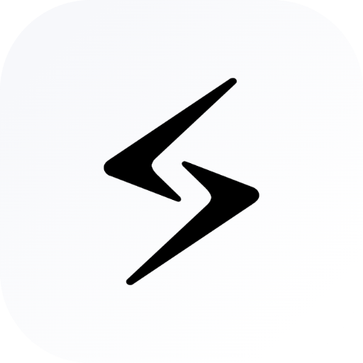
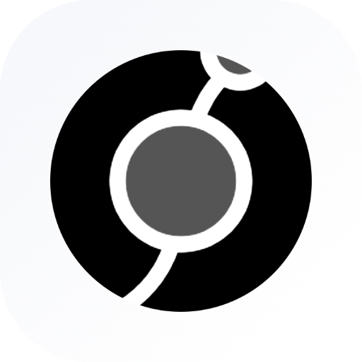
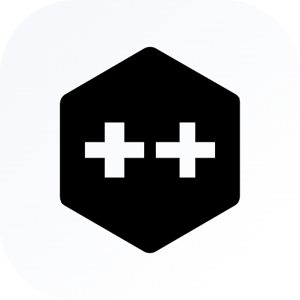
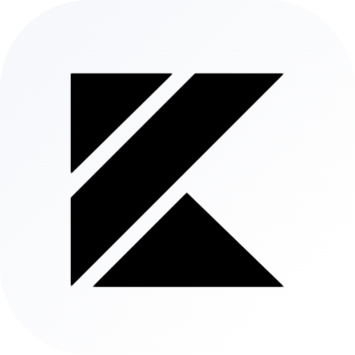
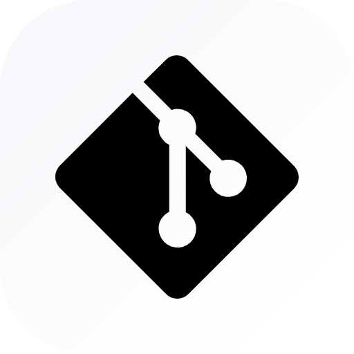

Hi, you've visited thenil3sh's profile page

## About Me
- I'm lazy
- Right now, I'm rooting into Android Dev with Kotlin (garbage collection, aww yes!!). Soon, on this profile, you'll notice some projects around it (and maybe don't).
- I love, solving my own problems, lol. Soon as I face it, appears a new project.
- Working on webassembly is also something I enjoy (just to avoid writing another line of javascript).

## My daily drivers
<picture>
  <source
    srcset="./assets/light-theme/arch.png"
    media="(prefers-color-scheme: light)"/>
  <source
    srcset="./assets/dark-theme/arch.png"
    media="(prefers-color-scheme: dark)"/>
  
</picture>

<picture>
  <source
    srcset="./assets/light-theme/zed.png"
    media="(prefers-color-scheme: light)"/>
  <source
    srcset="./assets/dark-theme/zed.png"
    media="(prefers-color-scheme: dark)"/>
  
</picture>

<picture>
  <source
    srcset="./assets/light-theme/bash.png"
    media="(prefers-color-scheme: light)"/>
  <source
    srcset="./assets/dark-theme/bash.png"
    media="(prefers-color-scheme: dark)"/>
  
</picture>

<picture>
  <source
    srcset="./assets/light-theme/rust.png"
    media="(prefers-color-scheme: light)"/>
  <source
    srcset="./assets/dark-theme/rust.png"
    media="(prefers-color-scheme: dark)"/>
  
</picture>

<picture>
  <source
    srcset="./assets/light-theme/slint.png"
    media="(prefers-color-scheme: light)"/>
  <source
    srcset="./assets/dark-theme/slint.png"
    media="(prefers-color-scheme: dark)"/>
  
</picture>

<picture>
  <source
    srcset="./assets/light-theme/leptos.png"
    media="(prefers-color-scheme: light)"/>
  <source
    srcset="./assets/dark-theme/leptos.png"
    media="(prefers-color-scheme: dark)"/>
  
</picture>

<picture>
  <source
    srcset="./assets/light-theme/cpp.png"
    media="(prefers-color-scheme: light)"/>
  <source
    srcset="./assets/dark-theme/cpp.png"
    media="(prefers-color-scheme: dark)"/>
  
</picture>

<picture>
  <source
    srcset="./assets/light-theme/kotlin.png"
    media="(prefers-color-scheme: light)"/>
  <source
    srcset="./assets/dark-theme/kotlin.png"
    media="(prefers-color-scheme: dark)"/>
  
</picture>

<picture>
  <source
    srcset="./assets/light-theme/git.png"
    media="(prefers-color-scheme: light)"/>
  <source
    srcset="./assets/dark-theme/git.png"
    media="(prefers-color-scheme: dark)"/>
  
</picture>

<picture>
    <source
    srcset="./assets/light-theme/android.png"
    media="(prefers-color-scheme: light)"/>
  <source
    srcset="./assets/dark-theme/android.png"
    media="(prefers-color-scheme: dark)"/>
  
</picture>

## Proof I do stuff
<picture>
  <source
    srcset="https://github-readme-stats-one-rho-93.vercel.app/api?username=thenil3sh&bg_color=0e141c&border_color=3d454cff&text_color=ffffff&border_radius=6.5&custom_title=.%20.%20.%20um&text_bold=false&show_icons=true&show=prs_merged&title_color=ffffff&icon_color=ffffff"
    media="(prefers-color-scheme: dark)"/>
  <source 
    srcset="My Github Stats" src="https://github-readme-stats-one-rho-93.vercel.app/api?username=thenil3sh&bg_color=00000000&border_color=d0d9e1&border_radius=6.5&custom_title=.%20.%20.%20um&&text_bold=false&show_icons=true&icon_color=0869db&icons_color=0869db&show=prs_merged"
    media="(perfers-color-scheme: light)"/>
  
</picture>

<!-- 
&nbsp;
<picture>
  <source
    srcset="https://github-readme-stats-one-rho-93.vercel.app/api/top-langs?username=thenil3sh&bg_color=0e141c&border_radius=6.5&text_bold=false&border_color=3d454c&size_weight=0&count_weight=1&layout=donut&text_color=ffffff&custom_title=(⁠人⁠ ⁠•͈⁠ᴗ⁠•͈⁠)&langs_count=4&card_witdh=100&exclude_repo=password-generator&title_color=ffffff&ring_color=ffffff"
    media="(prefers-color-scheme: dark)"/>
  <source
    srcset="https://github-readme-stats-one-rho-93.vercel.app/api/top-langs?username=thenil3sh&bg_color=00000000&border_radius=6.5&text_bold=false&border_color=d0d9e1&size_weight=0&count_weight=1&layout=donut&custom_title=(⁠人⁠ ⁠•͈⁠ᴗ⁠•͈⁠)&langs_count=4&card_witdh=100&exclude_repo=password-generator"
    media="(prefers-color-scheme: light)"/>
  

</picture> 
-->
